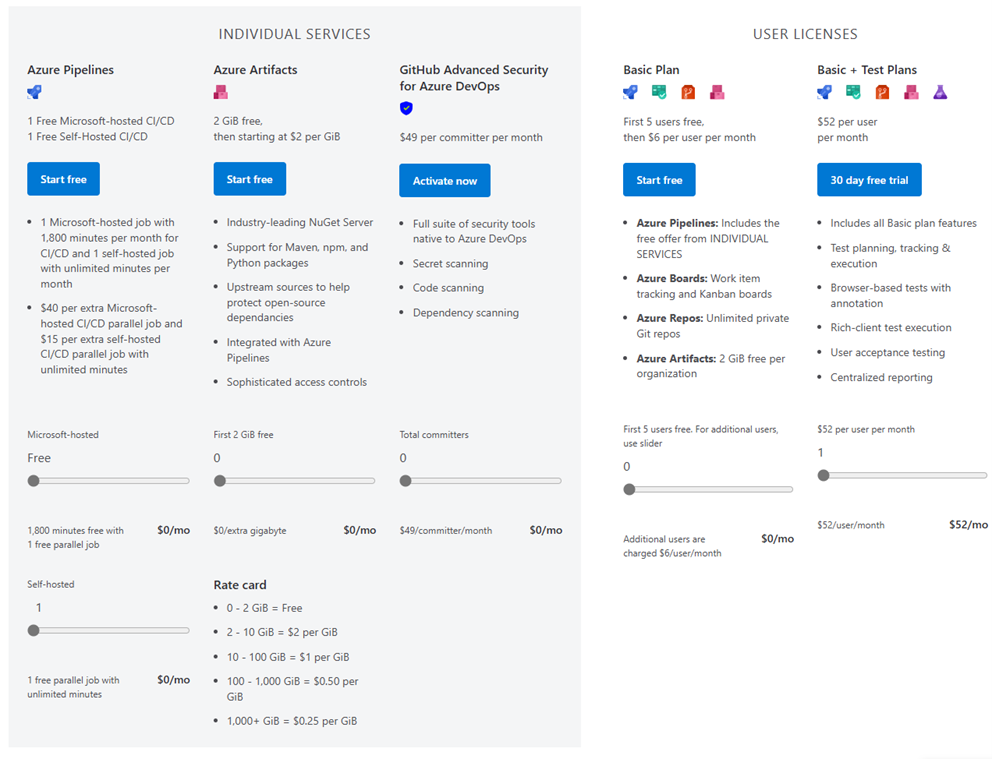
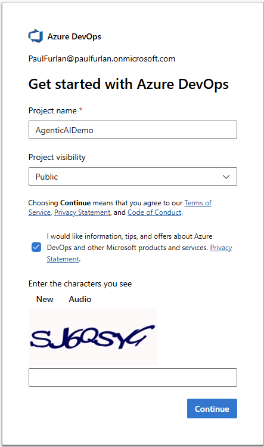
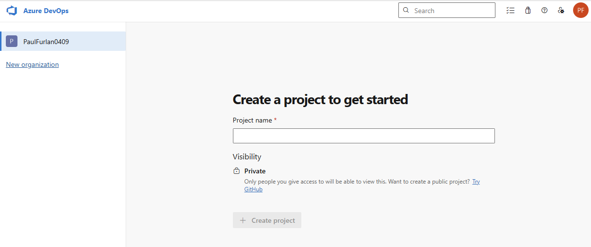
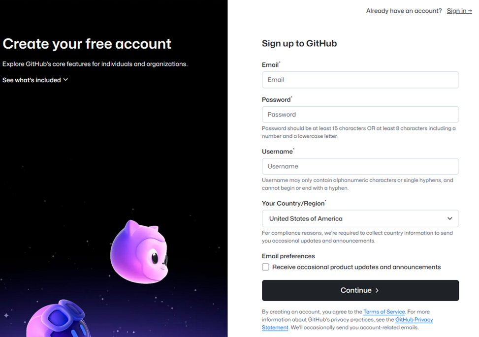
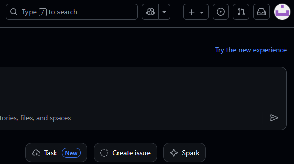
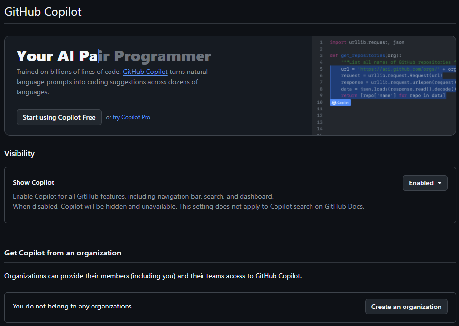

   # AgenticAiForDevSecOps

  This repository contains the lab instructions for the 'Agentic AI for DevSecOps' Oreilly Live Lesson  
  
 Follow the instruction in the [Getting started](#getting-started) setion to set up the necessary accounts for these labs.
 

1. [Lab 1: Explore AI models and set up GitHub Copilot](./lab1.md)
1.  [Lab 2: Create a project with AI in Codespaces](./lab2.md)
1.  [Lab 3: Use pull requests to integrate code changes](./lab3.md)
1. [Lab 4: Automate tasks with Azure pipelines](./lab4.md)
1. [Lab 5: Create a source code release](./lab5.md)
 
 

### Sample code:
[Sample GitHub repository](https://github.com/kidcuda82-cmd/ado-ai)
This repository contains the sample code used in the labs. 

 

## Getting Started

1. Review Azure DevOps and sign up for an account in the following link:  
    [https://azure.microsoft.com/en-us/pricing/details/devops/azure-devops-services/](https://azure.microsoft.com/en-us/pricing/details/devops/azure-devops-services/)
 

2. The free tier will be more than enough in this course, so click on any of the ‘start free’ buttons  
   
 

3. Once you authenticate with your Microsoft account, create a project and make sure the project visibility is set to ‘public’.
   
   This will take you to the following page, :
   
   📝 **Note:** You can leave this tab open as we will use it in the upcoming lessons.

    

4. Next, sign up for a GitHub account (in case you don’t already have one) at:  
   [https://github.com/signup](https://github.com/signup)  
   
 

5. Next, we will enable GitHub Copilot.  
   Click on your profile at the top right corner and next click on ‘Copilot Settings’  
   
    

6. Make sure ‘Show Copilot’ appears as enabled:  
   
