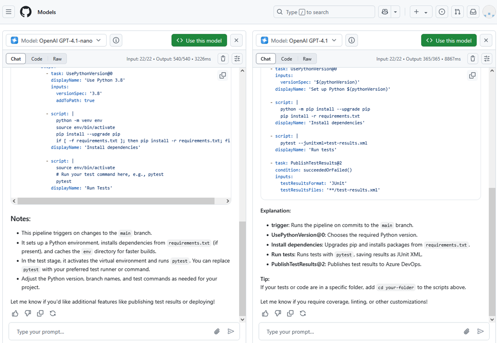
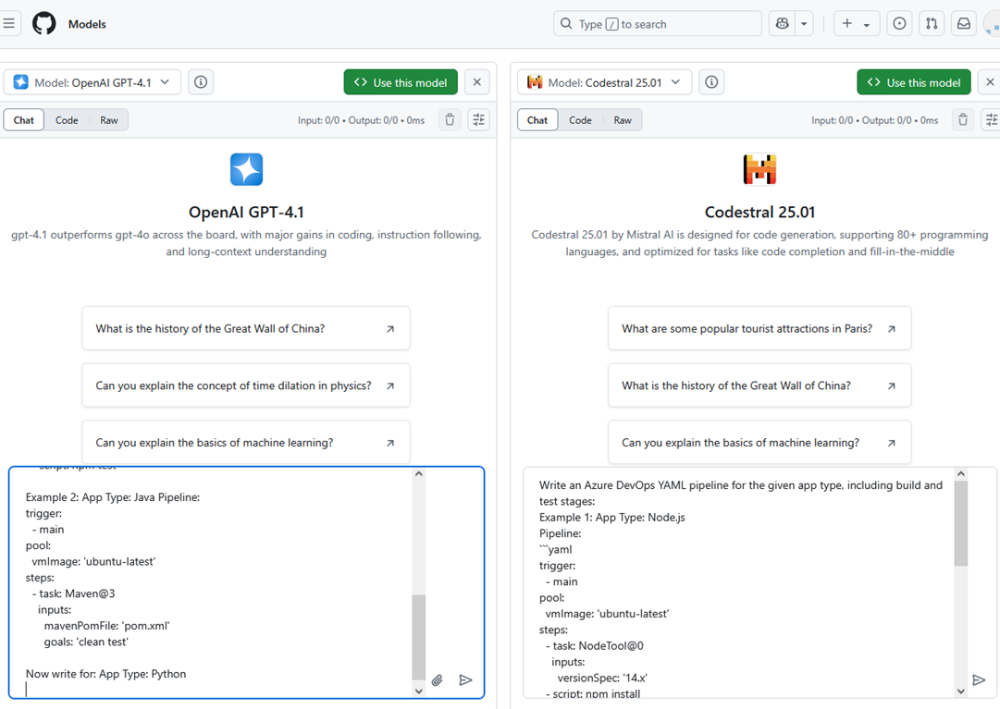
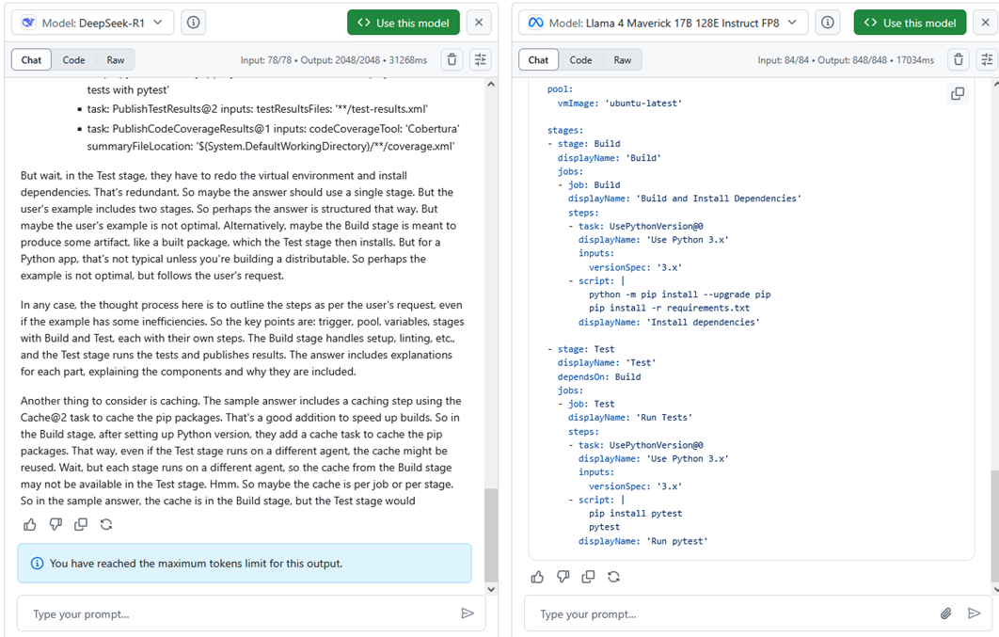
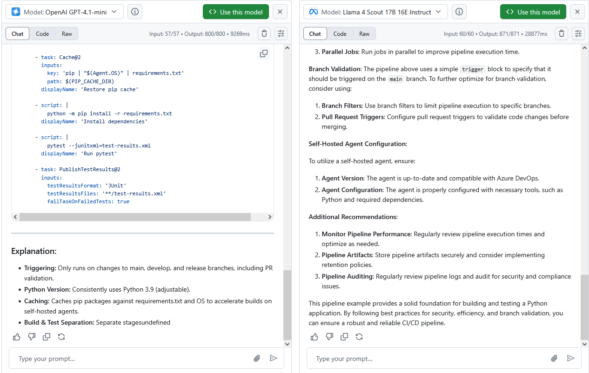
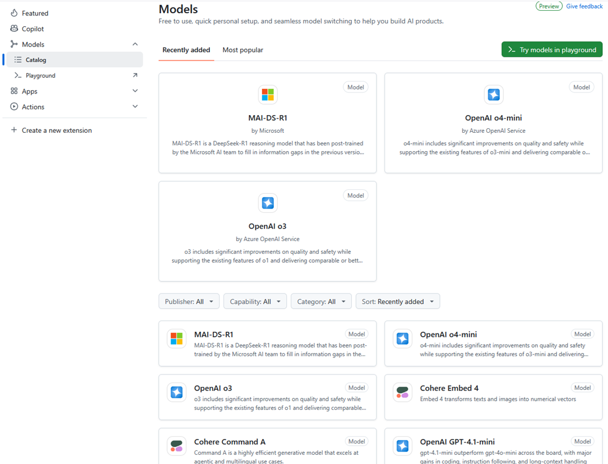
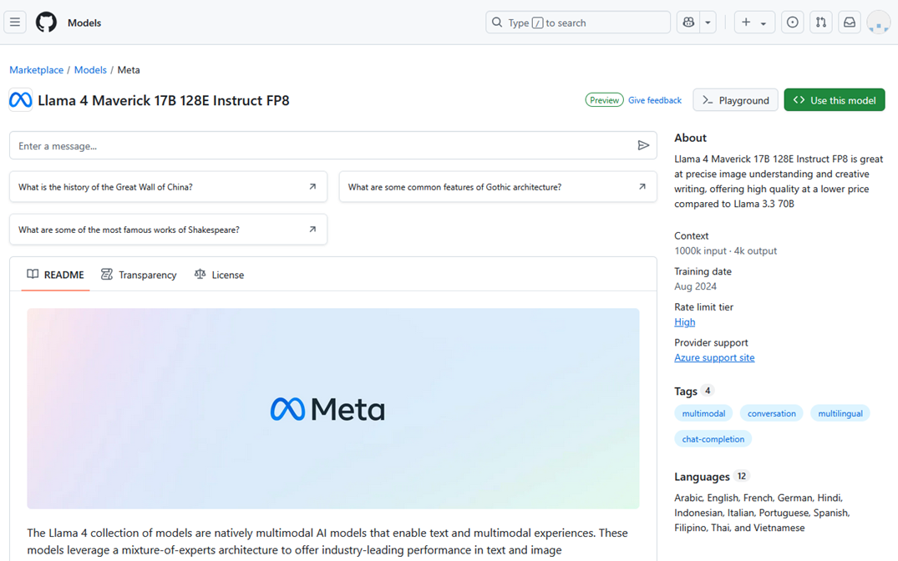

1.	For this lab, lets head on over to the GitHub Models playground: 

    [Github Marketplace models](https://github.com/marketplace/models)

    !!! Note: This feature is in preview, so results may vary.

<br/>

2.	Here is a quick overview of some of the models that can be used with GitHub Copilot:

    💳 Balance between cost and performance:
    Go with GPT-4o or Claude 3.5 Sonnet.
    
    🪙 Fast, lightweight tasks:
    o3-mini or Claude 3.5 Sonnet are your buddies.

    💎 Deep reasoning or complex debugging:
    Think GPT-4.5, o1, or Claude 3.7 Sonnet.

    🖼️ Multimodal inputs (like images):
    Check out Gemini 2.0 Flash or GPT-4o.

    <br/>

    [Which AI model should I use with GitHub Copilot? - The GitHub Blog](https://github.blog/ai-and-ml/github-copilot/which-ai-model-should-i-use-with-github-copilot/)

<br/>

3. Let’s test out ‘one-shot prompting’.
    Select OpenAI GPT-4.1-nano then click on compare and select OpenAI GPT-4.1 

    !!!  note if no models appear in the dropdown, click on any of the models at the bottom part of the ‘Welcome to GitHub Models’ screen.
 
    <br/>

     In the prompt area, enter the following:  
    "Write an Azure DevOps YAML pipeline to build a Python app and run tests."
    
    <br/>

    !!! note: Nano should be extremely fast as its intended for use cases where latency and resource efficiency are important.  

<br/>

4. Next, lets test ‘few-shot prompting’
    Select OpenAI GPT-4.1 and Codestral 25.01 (Feel free to try out any model)

    ```yaml
    Write an Azure DevOps YAML pipeline for the given app type, including build and test stages:

    Example 1: App Type: Node.js
    Pipeline:

    trigger:
    - main
    pool:
    vmImage: 'ubuntu-latest'
    steps:
    - task: NodeTool@0
        inputs:
        versionSpec: '14.x'
    - script: npm install
    - script: npm test

    Example 2: App Type: Java Pipeline:
    trigger:
    - main
    pool:
    vmImage: 'ubuntu-latest'
    steps:
    - task: Maven@3
        inputs:
        mavenPomFile: 'pom.xml'
        goals: 'clean test'

    Now write for: App Type: Python
    ```
    <br/>

    
    <br/>

    !!! Notice Notice how Codestral is a lot faster in this case, but less detailed than 

    <br/>

5. Now lets try ‘chain-of-thought prompting’
    Lets use Deepseek R1 vs Llama 4 Maverick for this test

    ```yaml
    Write an Azure DevOps YAML pipeline for a Python app, reasoning step-by-step to include build and test stages:
    Step 1: Identify the app type and its typical build requirements.
    Step 2: Determine necessary pipeline components (e.g., trigger, pool).
    Step 3: Select tasks for building and testing.
    Step 4: Construct the YAML with explanations.
    ```
    <br/>

    

    !!! Notice On some examples you may reach the maximum token limit for the output
    <br/>
    
6.  And next, we will try ‘role-based prompting’
    For this lets try OpenAI GPT-4.1 mini vs Llama 4 Scout 17B

    ```yaml
    As an Azure DevOps specialist with expertise in CI/CD automation, write an Azure DevOps YAML pipeline for a Python app, including build and test stages, optimized for a self-hosted agent:
    Ensure the pipeline is secure and efficient for branch validation.
    ```
    <br/>

    

    <br/>

7. You can explore more details about the available models in the GitHub Marketplace by clicking on Models:
    [Github Marketplace models](https://github.com/marketplace?type=models)

    

    <br/>

8. In the marketplace you can find more details about each model by clicking on it. Such as its training date, context, description and more.

    


