1)	For this lab, we will need to make sure the build service will have permissions to interact with the git repository
Click on project settings > repositories > security
Select the ado-ai Build Service user and make sure the following are set to allow:
bypass policies when pushing: Allow
Contribute: Allow
Create branch: Allow
Create tag: Allow
Read: allow
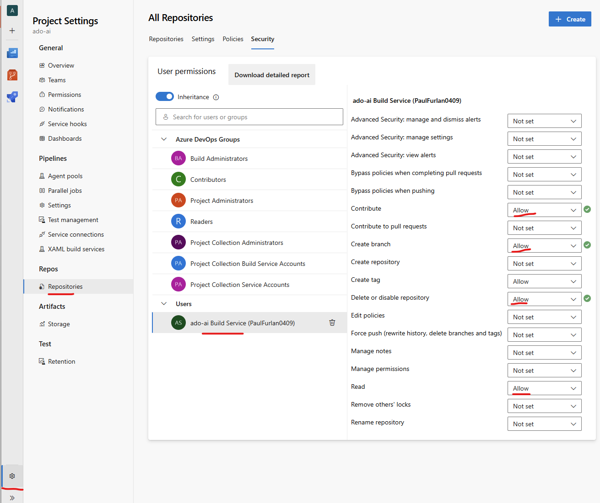

<br/>

2)	Go back to GitHub Codespaces, and make sure you are on the main branch and pull changes

<br/>

3)	Input the following prompt in GitHub Copilot:

As a highly experienced release manager, help us release this application and add release notes, avoid using powershell.
Step 1: create a new branch for these changes
Step 2:  add a step in the azure devops pipeline to create the git tag for this release using semantic versioning 
Step 3: add a step in the azure devops pipeline to create the release notes in a changelog file
Step 4: add a step in the azure devops pipeline to zip the application and publish it as an artifact <br/>
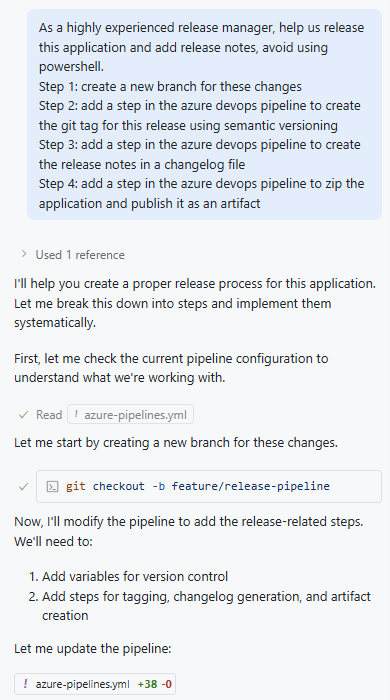 <br/>
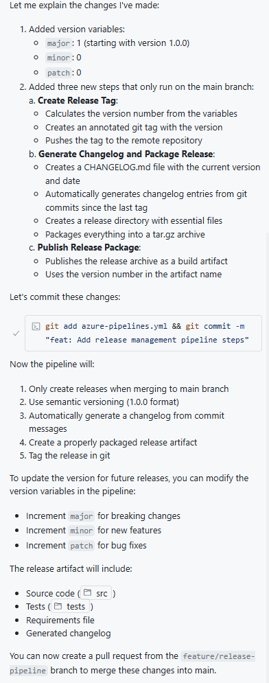
<br/>

4)	Next, publish the branch (or commit changes if needed)
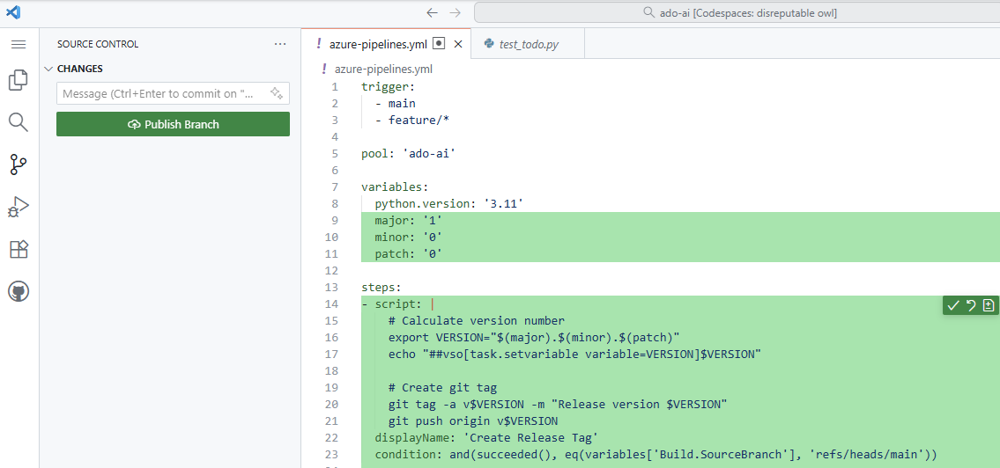

<br/>

5)	Next, review the pipeline to make sure everything looks good:
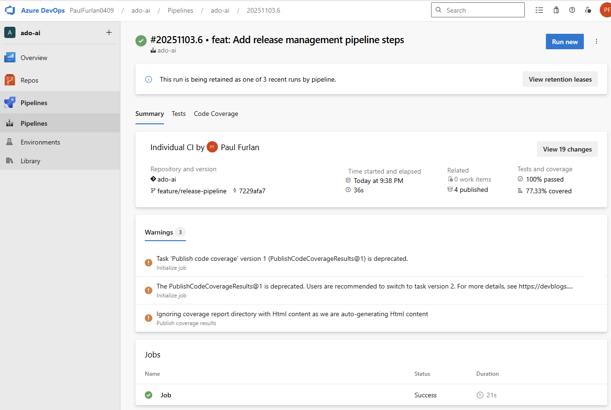

<br/>

6)	And merge it to the main branch by creating a pull request:
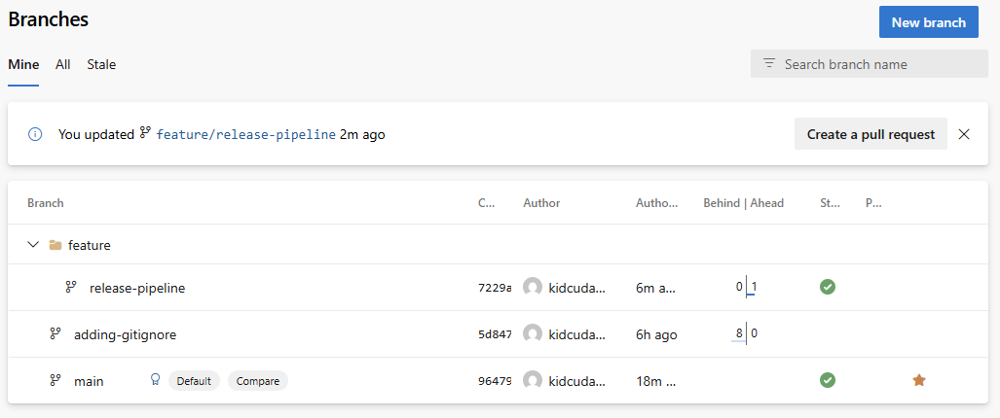
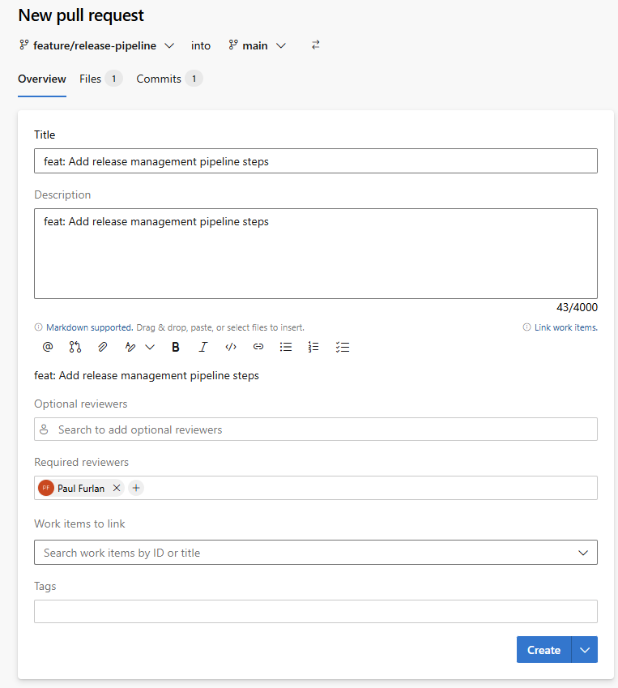
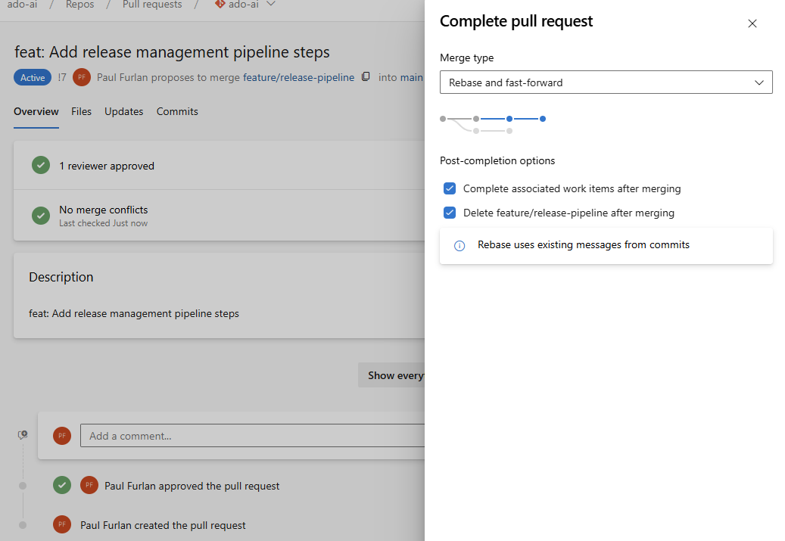
<br/>

7)	 Unfortunately, the pipeline failed when running on the main branch due to an authentication error:
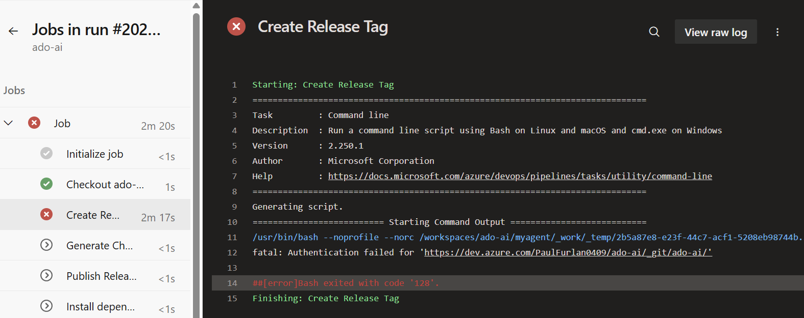

<br/>

8)	Lets go back to codespaces and resolve this issue:
Make sure you are on the main branch, then pull latest changes
Then input the following prompt
```
The ‘<failed step display name>’ is running into an error:
<error message>. Create a new branch and fix this error
```
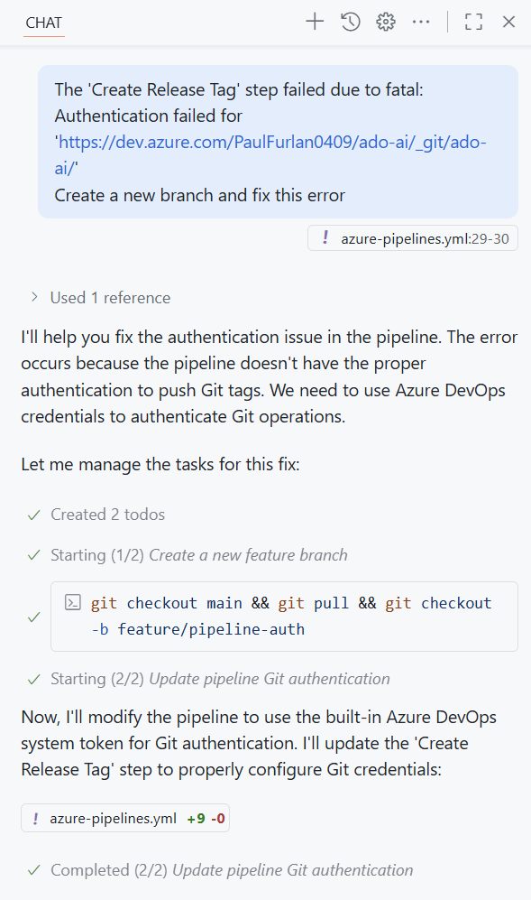
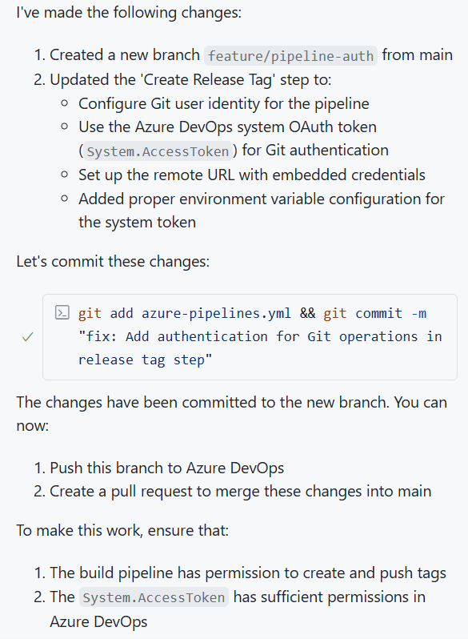

<br/>

9)	Next lets publish the branch:
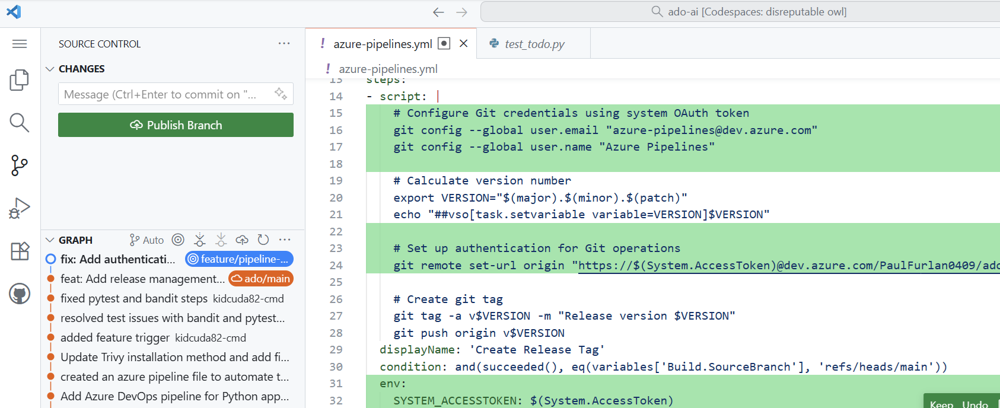

<br/>

10)	 And create a new pull request and merge it to main
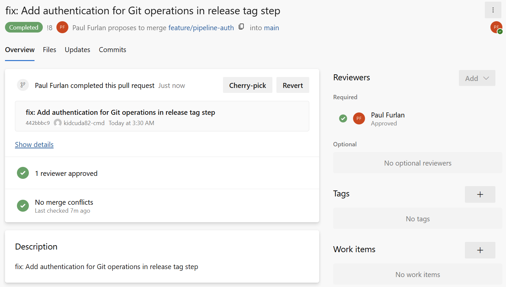

<br/>

11)	After merging the branch If the new pipeline in the main branch succeeded you should be able to see a tag with the version specified in the azure-pipeline.yml file
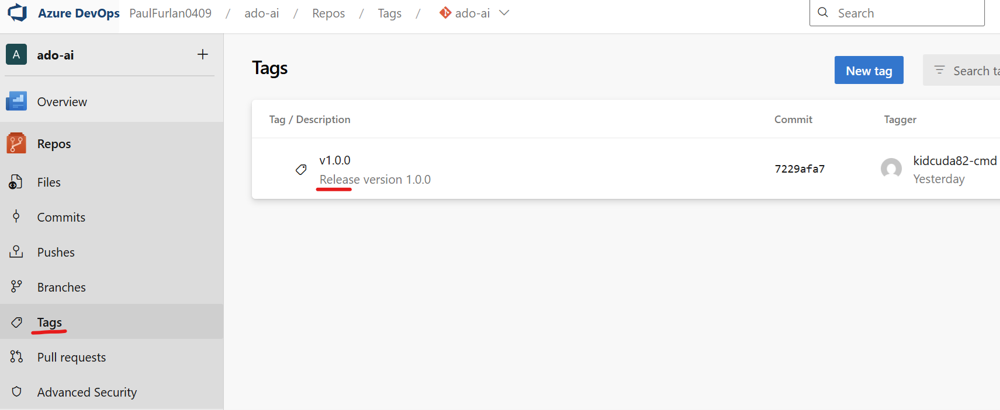

<br/>

12)	As well as the artifacts which contain the changelog file
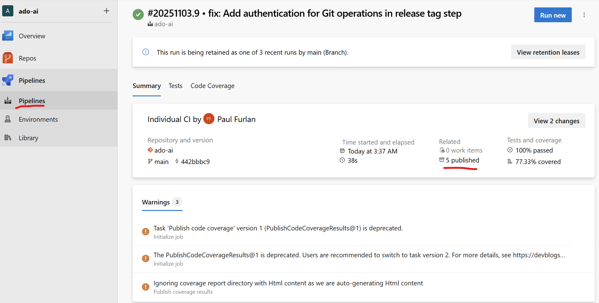
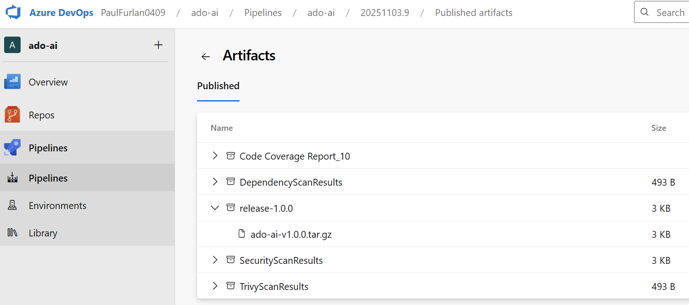
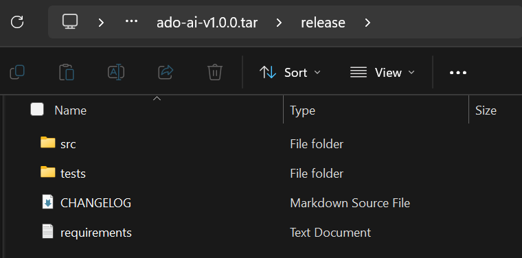
<br/>

### And that concludes lab 5! You have successfully implemented a release pipeline with the assistance of AI!
⭐
### Congratulations on completing all the labs in this series! You have gained hands-on experience in leveraging AI to enhance your software development lifecycle, from coding, security and code reviews to CI/CD pipelines. Keep exploring and applying these skills in your future projects!
🏆

